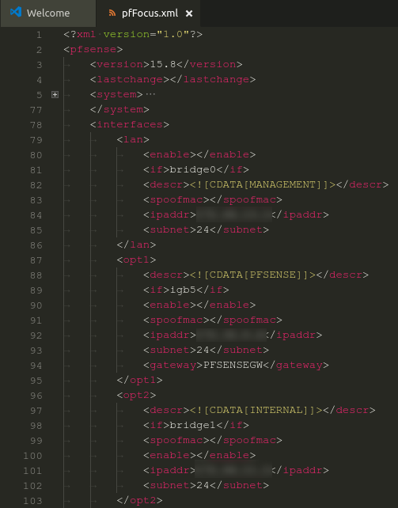
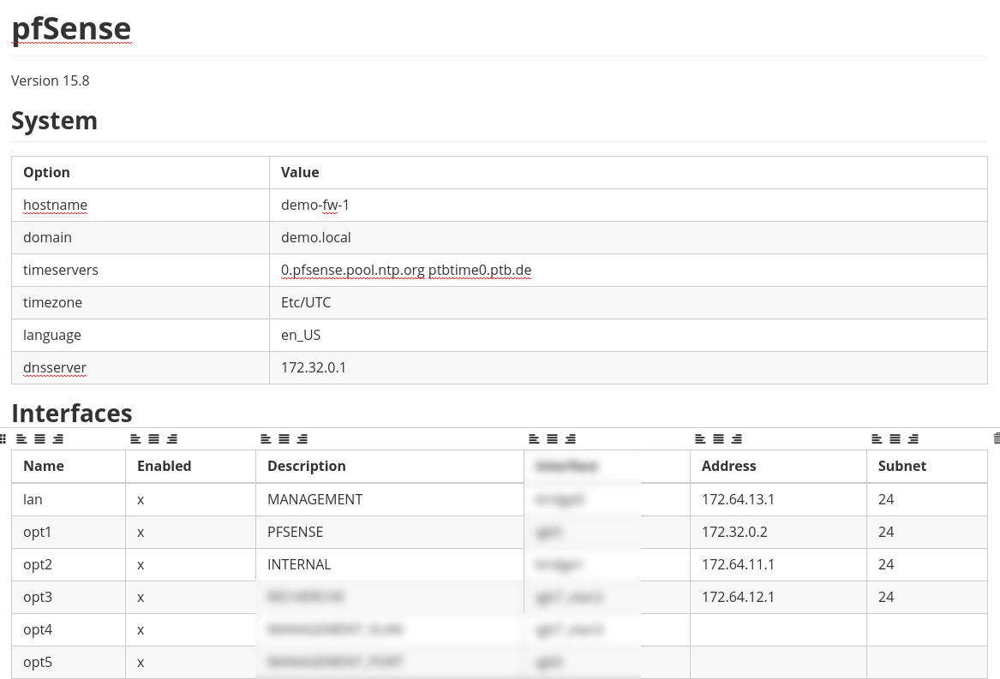
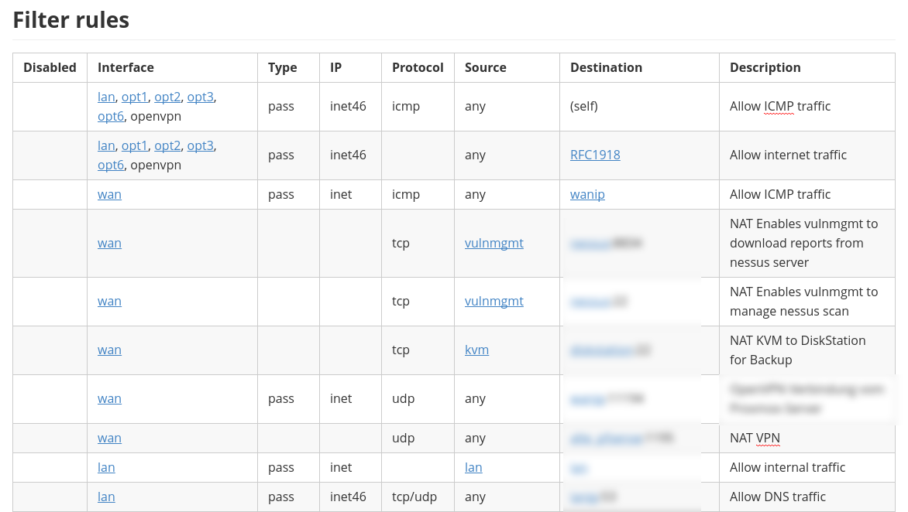

# pfFocus

[](https://travis-ci.org/TKCERT/pfFocus)

This simple tool allows you to convert a full configuration backup of a *pf*Sense firewall into some meaningful output format, like Markdown or YAML. It enables you to **focus** on the important parts of your firewall configuration and allows you to get a quick overview of the most important settings.

## Requirements

* Python 3.5+
    * defusedxml==0.5.0
    * PyYAML==3.12

or

* Docker

## Screenshots

**Before:** Configuration backup as XML



**After:** Markdown documentation




## Features

pfFocus currently supports the following configuration sections:

* Basic system information
* List of interfaces, VLANs, bridges, gateways and static mappings
* List of DHCP ranges and aliases
* NAT rules with alias and interface resolution
* Outbound NAT rules with alias and interface resolution
* Filter rules with alias and interface resolution
* DNS forwarder (DNSmasq) configuration
* OpenVPN server and client configurations
* Syslog and sysctl configuration

## Install (Windows WSL Ubuntu)
```
git clone https://github.com/TKCERT/pfFocus.git
apt update
apt install python3-pip -y
cd pfFocus/
pip3 install -r requirements.txt
pip3 install ./
done!
```
## Usage

Main formatting tool: ```pf-format```
```
pf-format
```

Examples:
```
pf-format -i config-backup.xml -f md -o test.md
pf-format -i config-backup.xml -f yaml -o test.yaml
```

Test parsing tool: ```pf-parse```
```
pf-parse [-h] input_path
```

Examples:
```
pf-parse config-backup.xml
```

### Usage with Docker

When using pfFocus via Docker, you don't need to download it from Github, and you don't need to install Python or any libraries. Only Docker is required.

It runs this command inside Docker: `pf-format -q -f md -i - -o -`, which means it works with `STDIN` and `STDOUT` instead of files.

```bash
docker run --rm -i hugojosefson/pffocus < input.xml > output.md
```

If you want you can set up an alias for it in bash:

```bash
alias pffocus="docker run --rm -i hugojosefson/pffocus"
```

Then you can use it like a normal Unix command, with pipes and redirects:

```bash
pffocus < input.xml > output.md
```

## Roadmap

Some ideas for the future development of pfFocus:

* Producing additional output formats, especially structured formats like CSV.
* Using these structured formats to enable easy diff'ing of configurations.
* Maybe functionality to correlate rule configurations of different firewalls.

## Credits

* Thomas Patzke ([@thomaspatzke](https://github.com/thomaspatzke)) for
    * valuable suggestions and feedback
* Florian Roth ([@Cyb3rOps](https://twitter.com/Cyb3rOps)) for
    * giving it the name *pfFocus*
    * the very nice and gorgeous logo
